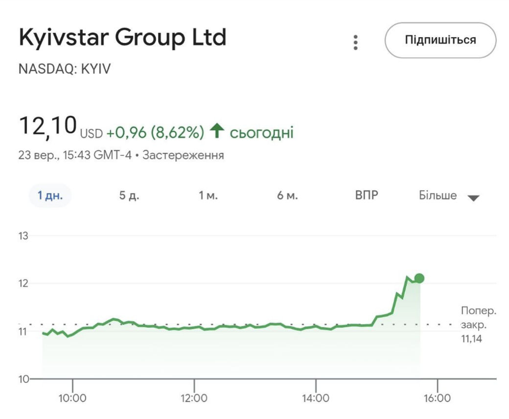

# Risk Analysis of Kyivstar (NASDAQ: KYIV)

## Project Overview
Kyivstar was listed on NASDAQ in August 2025, meaning there is very limited historical data available.  
To estimate its potential risk profile, this project uses **Value at Risk (VaR)** and **Expected Shortfall (ES)** methods, both historical and Monte Carlo, with **VEON** (Kyivstar’s parent company) as a proxy for volatility.

The main question: **Should I invest in Kyivstar?**

---

## Methods
**Data Collection**
   - Stock price data from Yahoo Finance for KYIV and VEON.
   - Timeframe: from August 15, 2025 to present.

**Monte Carlo Simulation**
   - 5,000 simulated paths over 252 trading days.
   - Parameters (μ, σ) estimated from VEON.
---

## Results
- **Historical daily VaR (95%):** 9.53%  
- **Historical daily ES (95%):** 12.59%  
- **Monte Carlo 1-year VaR (95%):** 34.27%  
- **Monte Carlo 1-year ES (95%):** 45.72%  
  
If you invested **100 USD** on August 15th, the simulation suggests that after 1 year:  
- In the worst 5% of cases, you could lose **~34 USD or more**.  
- On average, in those worst cases, you could lose **~46 USD**.

---

## Limitations
- Very limited data for KYIV (only ~1 month since listing).  
- VEON is only a partial proxy: it is larger and more diversified.  
- Monte Carlo relies on assumptions (normal distribution, constant volatility) which may not hold.  
- Results should **not** be treated as reliable investment advice.

---

## Conclusion
Kyivstar currently shows **high risk** with potential for large downside moves.  
Given the lack of historical data and uncertainty around assumptions, the simulation is **not reliable enough** to form a confident investment decision.  
At this stage, **investing in KYIV appears highly speculative**.

---

## Update - Post-Listing Risk Confirmation

The stock performance of Ukrainian telecom operator Kyivstar demonstrates a pronounced sensitivity to the geopolitical situation in the region. This correlation was evident on September 23rd, when the company's share price rose 8.6% following constructive talks between Presidents Zelensky and Trump. Conversely, Kyivstar's initial public offering on the Nasdaq coincided with U.S.-Russia peace talks, during which its shares fell over 9% in early trading, highlighting investor wariness amid geopolitical uncertainty [(Reuters)](https://www.reuters.com/business/media-telecom/ukraines-kyivstar-lists-new-york-peace-talks-unfold-alaska-2025-08-15/?utm_source=chatgpt.com).

This volatility underscores how the ongoing war and political instability continue to deter risk-averse foreign investors, creating a high-risk environment [(AIvest)](https://www.ainvest.com/news/kyivstar-nasdaq-listing-high-risk-high-reward-play-ukraine-economic-recovery-2509/?utm_source=chatgpt.com). The critical investment question, therefore, is whether the potential reward of a post-war recovery justifies the current risk. Notably, the investment firm Rothschild & Co. has issued a "Buy" rating for Kyivstar, suggesting a belief in its long-term value proposition once stability returns [Investing.com](https://www.investing.com/news/analyst-ratings/rothschild-redburn-initiates-kyivstar-group-stock-with-buy-rating-93CH-4238067?utm_source=chatgpt.com).
